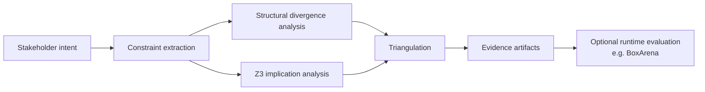

# SpecGap

SpecGap extracts **constrained capability obligations** from layered sandbox specifications (intent → policy → implementation, or candidate policies). It checks **implication failures** via Z3 over a declared **abstract sandbox model** and emits **counterexample behaviors** when a downstream layer permits abstract behaviors that upstream intent forbids.

It is **not** AI semantic understanding, sandbox verification, or exploit detection. See [What SpecGap does NOT do](#what-specgap-does-not-do) and [Assurance docs](#assurance-docs).

Clone this repository and run commands from the repo root (`specgap/` directory after clone).

Just want to run it? → [10-minute evaluator path](#10-minute-evaluator-path)

## Architecture

**SpecGap pipeline:**

```
Natural-language specification
  → extracted constraints
  → structural divergence analysis
  → Z3 implication checks
  → triangulation (agreement / disagreement preserved)
  → human-readable + machine-readable evidence artifacts
```



**Trust boundary:** SpecGap **stops at evidence generation**. It does not run containers, observe runtime behavior, or enforce policy. Runtime evaluation (e.g. [BoxArena](docs/BOXARENA_POSITIONING.md)) is **downstream and complementary**. Triangulation preserves heterogeneous evidence from independent mechanisms — it does not merge them into one verdict.

**TCB (compressed):** The primary trusted components are the rule extractor's phrase vocabulary, the hand-authored `WEAKER_OF` weakening lattice, the propositional abstract sandbox model, and Z3 satisfiability checking. See [`docs/TCB.md`](docs/TCB.md) and [`docs/ASSURANCE_BOUNDARY.md`](docs/ASSURANCE_BOUNDARY.md) for scope, attack surfaces, and limitations — not a claim of completeness or runtime assurance.

| Core (always) | Optional integrations |
| --- | --- |
| Rule-based constraint extraction | Candidate evaluation (`--evaluate-candidates`) |
| Structural divergence analysis (`WEAKER_OF` lattice) | BoxArena pre-flight (`--boxarena-preflight`) |
| Z3 implication checks (abstract sandbox model) | MCP wrapper ([`specgap-mcp/`](specgap-mcp/README.md)) |
| Triangulation (disagreement preserved) | |
| Evidence artifacts (Markdown reports, JSON evidence chains) | |

## Why this exists

Why not analyze the runtime directly? SpecGap does **not** inspect running implementations. It checks whether **stakeholder intent**, **formalized policy**, and **implementation claims** remain aligned **before** deployment or empirical runtime evaluation. The goal is not theorem-proving over infrastructure, but early detection of **specification divergence**, **constraint weakening**, and **abstraction drift** over extracted constraints in a bounded abstract model — while runtime tools answer a different question: what the system actually does under adversarial pressure.

## 10-minute evaluator path

1. `pip install -r requirements.txt` (venv recommended — see [Quick Start](#quick-start))
2. `python -m specgap.cli examples/sandbox_no_network.json --out reports/demo_report.md`
3. `python -m specgap.cli examples/04_paraphrased_sandbox.json --extractor rule` *(note extraction-failure WARNING)*
4. `pip install -r requirements-dev.txt && pytest`
5. Read [`docs/SPECIFICATION.md`](docs/SPECIFICATION.md)

---

## Problem

Automated verification discharges obligations quickly. The bottleneck is whether the obligation matches what stakeholders meant. In sandbox policy, intent ("no network access") drifts through policy ("localhost allowed") into implementation claims ("loopback only"). Each layer reads fine in isolation; together they may permit behavior the stakeholder believed was forbidden.

## What SpecGap does

Operationally (see [Architecture](#architecture)):

1. **Extract** canonical constraints from text (`no_network`, `localhost_only`, …) — rule mode by default, optional fuzzy paraphrase recovery (advisory).
2. **Compare** constraint sets across layers (structural specification-divergence signals).
3. **Check** with Z3 whether downstream layers respect upstream intent over the abstract sandbox model (see [implication direction](docs/SPECIFICATION.md#implication-direction)).
4. **Triangulate** structural diff vs Z3 outcomes per layer — disagreement is preserved when the independent mechanisms diverge.
5. **Report** implication failures and counterexample behaviors (e.g. `network_send=true, dest_localhost=true`).

Candidate mode and BoxArena pre-flight are [optional integrations](#architecture), not core trust-boundary changes.

## Why preserve disagreement?

Structural diff and Z3 implication checking operate **independently** over extracted constraints. They capture different abstraction-level properties (name-level weakening lattice vs propositional sandbox model). SpecGap **surfaces disagreement** instead of collapsing to one verdict because:

- Different abstractions catch different failure modes
- Disagreement may indicate a **WEAKER_OF lattice gap**, **encoding incompleteness**, or **abstraction mismatch** — not that one mechanism is "wrong"
- Example: [`examples/06_triangulation_disagreement.json`](examples/06_triangulation_disagreement.json) — structural silent, Z3 fails ([Tutorial 4](tutorials/04_triangulation_disagreement.md))

This is bounded assurance reporting, not statistical consensus or cross-validation.

## What SpecGap does NOT do

- Does **not** prove semantic correctness, security, or that intent was right.
- Does **not** model real kernels, seccomp, or container runtimes.
- Does **not** certify fuzzy extraction (advisory; requires human review).
- Does **not** generate or repair policies.
- A clean report means no divergence detected over **extracted constraints** in the **abstract sandbox model** — nothing stronger.

**PASS outcomes:** aligned layers (e.g. candidate A in `examples/05_candidate_policy_ranking.json`) produce **no implication failures** under the current abstract model and extracted constraints — not a proof of security or correctness.

## Quick Start

**Requires:** Python 3.10+, [Z3](https://github.com/Z3Prover/z3) via `z3-solver`.

```bash
cd specgap
python3 -m venv .venv
source .venv/bin/activate          # Windows: .venv\Scripts\activate
pip install -r requirements.txt
python -m specgap.cli examples/sandbox_no_network.json --out reports/demo_report.md
```

Open `reports/demo_report.md` — see **Z3 implication check** and **Counterexample** sections.

### Known setup issues

- **PEP 668 (system Python):** On macOS/Linux with externally managed Python, `pip install` may fail. Use a venv (above) or `pip install --user -r requirements.txt`.
- **Editable install:** `pip install -e .` also works (reads `pyproject.toml`).
- **Tests:** `pip install -r requirements-dev.txt && pytest`

## Replayability

SpecGap runs are intended to be auditable without hidden state:

- **Deterministic CLI** — same JSON input and `--extractor rule` yield the same extraction and Z3 results
- **Reproducible examples** — `examples/*.json` tracked in the repository
- **Reference reports** — `reports/demo_report.md`, `reports/05_candidate_evaluation_report.md` (regenerate via CLI)
- **pytest** — 41 tests; Z3 implication checks are not mocked

Record input path, extractor mode, Python version, and `z3-solver` version when citing results. See [`docs/SPECIFICATION.md#replayability`](docs/SPECIFICATION.md#replayability).

## Judge path (~3 minutes)

```bash
cd specgap && source .venv/bin/activate   # if using venv

# 1. Headline divergence
python -m specgap.cli examples/sandbox_no_network.json --out reports/demo_report.md

# 2. Rule vs fuzzy extraction
python -m specgap.cli examples/04_paraphrased_sandbox.json --extractor rule --out reports/04_rule_report.md
python -m specgap.cli examples/04_paraphrased_sandbox.json --extractor fuzzy --out reports/04_fuzzy_report.md

# 3. Candidate policy evaluation
python -m specgap.cli examples/05_candidate_policy_ranking.json --evaluate-candidates

# 4. Triangulation disagreement (structural silent, Z3 fails)
python -m specgap.cli examples/06_triangulation_disagreement.json --out reports/06_triangulation_disagreement_report.md

# 5. Tests (real Z3, not mocked)
pip install -r requirements-dev.txt
pytest
```

**Takeaway:** SpecGap locates specification divergence and shows a counterexample for each implication failure in the abstract model.

## Tutorials

Step-by-step walkthroughs with verified commands and expected output:

| Tutorial | Topic |
| --- | --- |
| [tutorials/01_detecting_a_semantic_gap.md](tutorials/01_detecting_a_semantic_gap.md) | Intent/policy/implementation, Z3 implication failure |
| [tutorials/02_rule_vs_fuzzy_extraction.md](tutorials/02_rule_vs_fuzzy_extraction.md) | Vocabulary-bound rules, extraction-failure guard, fuzzy recovery |
| [tutorials/03_candidate_policy_evaluation.md](tutorials/03_candidate_policy_evaluation.md) | Candidate evaluation, implementation discrimination |
| [tutorials/04_triangulation_disagreement.md](tutorials/04_triangulation_disagreement.md) | Structural vs Z3 disagreement (triangulation) |

See [tutorials/README.md](tutorials/README.md) for 10- and 30-minute reading paths.

## Examples

| File | Divergence |
| --- | --- |
| `examples/sandbox_no_network.json` | `no_network` vs `localhost_only` |
| `examples/sandbox_readonly_fs.json` | read-only intent vs writable `/tmp` |
| `examples/syscall_policy_mismatch.json` | no privesc vs setuid allowed |
| `examples/04_paraphrased_sandbox.json` | "air-gapped" paraphrase (rule fails, fuzzy recovers) |
| `examples/05_candidate_policy_ranking.json` | Three candidates vs one intent (A: no implication failure) |
| `examples/06_triangulation_disagreement.json` | Structural silent, Z3 fails — triangulation disagreement |
| `examples/boxarena_preflight_divergence.json` | BoxArena pre-flight fail (network spec drift + quest context) |
| `examples/boxarena_preflight_pass.json` | BoxArena pre-flight pass (aligned read-only spec) |

Reference report: [`reports/05_candidate_evaluation_report.md`](reports/05_candidate_evaluation_report.md) (regenerate with `--evaluate-candidates --out …`).

## Limitations

- Rule extraction uses a fixed vocabulary; unrecognized phrasing is not extracted.
- Fuzzy mode is opt-in; extracted fuzzy constraints require human review.
- Z3 model is propositional abstraction — counterexamples are illustrative, not exploit proofs.
- Three fixed layers (or N candidates); no multi-document specs or version history.

See [`docs/BOXARENA_POSITIONING.md`](docs/BOXARENA_POSITIONING.md) for the **SpecGap pre-flight → BoxArena runtime** workflow. Pre-flight adapter:

```bash
python -m specgap.cli examples/boxarena_preflight_divergence.json \
  --boxarena-preflight --evidence-out reports/boxarena_preflight_evidence.json
```

SpecGap does **not** run BoxArena; it emits an advisory evidence chain before empirical evaluation.

## Assurance docs

These documents define the abstract model, trusted assumptions, correctness target, and encoding boundaries used by SpecGap:

| Document | Contents |
| --- | --- |
| [`docs/SPECIFICATION.md`](docs/SPECIFICATION.md) | Correctness target, scope, implication direction, replayability |
| [`docs/ASSURANCE_BOUNDARY.md`](docs/ASSURANCE_BOUNDARY.md) | Assurance boundary, attack surfaces, inside/outside scope |
| [`docs/TCB.md`](docs/TCB.md) | Trusted computing base and abstraction limits |
| [`docs/ENCODING.md`](docs/ENCODING.md) | Behavior atoms, constraint formulas, known vacuities |

## Project structure

```
specgap/
├── specgap/           # Python package (cli, extractor, z3_checker, reporter, …)
│   └── integrations/  # boxarena_adapter.py — pre-runtime bridge (not runtime eval)
├── specgap-mcp/       # Local stdio MCP wrapper (analyze_spec, evaluate_candidates, boxarena_preflight)
├── docs/              # SPECIFICATION, ASSURANCE_BOUNDARY, TCB, ENCODING, BoxArena positioning
├── examples/          # Input JSON specs (tracked despite repo *.json ignore)
├── tutorials/         # Research onboarding walkthroughs
├── reports/           # Generated Markdown (reference copies: demo_report, 05_*)
├── tests/             # pytest suite
├── submission/        # Demo checklist and validation record
├── requirements.txt
└── pyproject.toml
```
