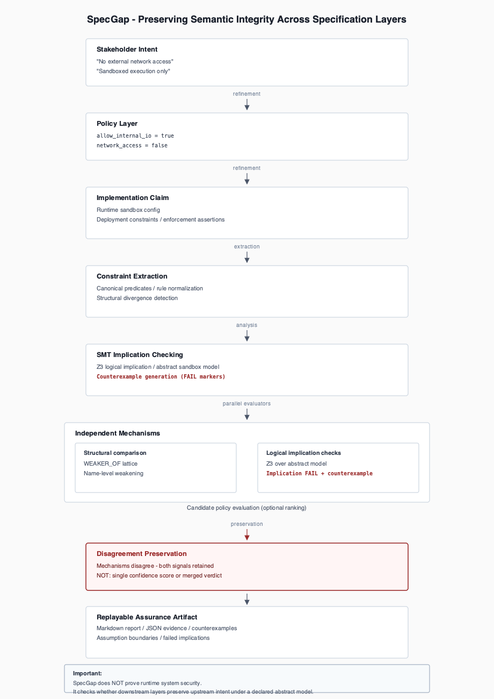

# SpecGap

**Layer:** Assurance

## Position in OMEGA Lab

Pre-runtime specification divergence evidence. Does not replace runtime evaluation. See [docs/ASSURANCE_BOUNDARY.md](docs/ASSURANCE_BOUNDARY.md). Stack map: [omega-contracts TRUST_STACK](https://github.com/repowazdogz-droid/omega-contracts/blob/main/docs/TRUST_STACK.md).


[](https://github.com/repowazdogz-droid/specgap/actions/workflows/test.yml)

**Pre-runtime specification assurance** for layered sandbox specs — intent, policy, and implementation claims.

SpecGap checks whether downstream policy and implementation layers still logically preserve upstream intent under a declared abstract model, while preserving disagreement between independent evaluators instead of collapsing them into a single verdict.

| If you have… | Go to |
| --- | --- |
| **3 minutes** | [Quickstart](#quickstart-3-minutes) |
| **10 minutes** | [Extended evaluation](#extended-evaluation-10-minutes) |
| **Hackathon review** | [`HACKATHON_JUDGE_GUIDE.md`](HACKATHON_JUDGE_GUIDE.md) |
| **Assurance boundary** | [What SpecGap does not claim](#what-specgap-does-not-claim) |

---

## The problem

**Specification assurance** breaks when semantic drift accumulates across layers. Each layer reads plausibly alone; downstream policy may permit behavior upstream intent forbids.

Stakeholder language becomes predicates, then implementation claims. Automated checks discharge obligations quickly — the bottleneck is whether the obligation still matches what stakeholders meant.

---

## The aha example

| Layer | Text |
| --- | --- |
| **Intent** | “No network access” |
| **Policy** | “Only localhost access” |
| **Result** | **FAIL** — downstream permits `network_send=true, dest_localhost=true`, which violates upstream `no_network`. |

SpecGap surfaces drift **before** deployment or adversarial evaluation. It does not run sandboxes or observe live infrastructure.

---

## Quickstart (3 minutes)

```bash
git clone https://github.com/repowazdogz-droid/specgap.git
cd specgap
python3 -m venv .venv
source .venv/bin/activate          # Windows: .venv\Scripts\activate
pip install -r requirements.txt
python -m specgap.cli examples/sandbox_no_network.json --out reports/demo_report.md
```

**Expected terminal output:**

```
SpecGap: analyzed 'Network-isolated analysis sandbox' (extractor: rule)
  semantic divergences: 3
  failed implication checks: 2 of 2
  report written to: reports/demo_report.md
```

**Inspect** [`reports/demo_report.md`](reports/demo_report.md):

| Section | What to look for |
| --- | --- |
| Extracted constraints | Intent `no_network` vs policy `localhost_only` |
| Z3 Formal Check | **Implication FAILS** — logical preservation failed in the abstract model |
| Counterexample | `network_send=true, dest_localhost=true` *(model behavior, not a runtime exploit)* |

<details>
<summary>Expected report excerpt</summary>

```markdown
### Formalized Policy ⇒ Stakeholder Intent

- **Result: implication FAILS.** … there is a behavior permitted by Formalized Policy
  that Stakeholder Intent forbids.
- Violated target constraint(s): `no_network`

Counterexample behavior:
- `network_send = true`
- `dest_localhost = true`
```

</details>

**Requires:** Python 3.10+, [Z3](https://github.com/Z3Prover/z3) via `z3-solver`.

---

## What's different

Most spec checkers collapse independent signals into one verdict. SpecGap is built around three constraints:

1. **Declared abstract model** — Z3 checks logical preservation inside a documented propositional sandbox encoding, not over live infrastructure.
2. **Independent mechanisms** — structural weakening lattice and Z3 implication run separately; outcomes are triangulated, not merged.
3. **Replayable evidence** — same JSON input and `--extractor rule` yield the same extraction and Z3 results; reports are regenerable artifacts.

→ Research note: [`docs/WHY_DISAGREEMENT_MATTERS.md`](docs/WHY_DISAGREEMENT_MATTERS.md)

---

## Architecture

<p align="center">
  <a href="docs/assets/specgap_architecture.svg">
    
  </a>
</p>

_SVG: [`docs/assets/specgap_architecture.svg`](docs/assets/specgap_architecture.svg)_

**Pipeline:** extract constraints → structural divergence → Z3 implication → triangulation → Markdown/JSON evidence.

Optional (same trust boundary): `--evaluate-candidates`, [`specgap-mcp/`](specgap-mcp/README.md), [`docs/BOXARENA_POSITIONING.md`](docs/BOXARENA_POSITIONING.md).

---

## Extended evaluation (10 minutes)

After [quickstart](#quickstart-3-minutes):

```bash
python -m specgap.cli examples/06_triangulation_disagreement.json --out reports/06_triangulation_disagreement_report.md
python -m specgap.cli examples/05_candidate_policy_ranking.json --evaluate-candidates --out reports/05_candidate_evaluation_report.md
python -m specgap.cli examples/04_paraphrased_sandbox.json --out reports/04_paraphrased_sandbox_report.md
pip install -r requirements-dev.txt && pytest -q
```

| Example | Purpose |
| --- | --- |
| [`sandbox_no_network.json`](examples/sandbox_no_network.json) | Semantic weakening + implication failure *(quickstart)* |
| [`06_triangulation_disagreement.json`](examples/06_triangulation_disagreement.json) | Structural silent, Z3 fails — **disagreement preserved** |
| [`05_candidate_policy_ranking.json`](examples/05_candidate_policy_ranking.json) | Candidate comparison — A PASS, B/C FAIL *(not a security score)* |
| [`04_paraphrased_sandbox.json`](examples/04_paraphrased_sandbox.json) | Extraction failure on paraphrase — vocabulary boundary |

**Also in repo:** [`sandbox_readonly_fs.json`](examples/sandbox_readonly_fs.json), [`syscall_policy_mismatch.json`](examples/syscall_policy_mismatch.json), [`boxarena_preflight_*.json`](examples/). Step-by-step: [`tutorials/README.md`](tutorials/README.md).

<details>
<summary>How to read triangulation disagreement</summary>

In `06_triangulation_disagreement_report.md`, look for **Agreement = no**:

```markdown
| Layer              | Structural              | Z3 implication | Agreement |
| Formalized Policy  | no_divergence_detected  | fails          | **no**    |
```

Structural diff and Z3 captured different abstraction-level properties. SpecGap reports both — it does not pick a winner.

</details>

---

## Why disagreement matters

- **Structural diff** — name-level `WEAKER_OF` lattice over extracted constraint names
- **Z3** — propositional formulas over behavior atoms in the abstract model

When they diverge, both signals stay visible. That may indicate a lattice gap, encoding incompleteness, or abstraction mismatch — not that one mechanism is wrong.

---

## What SpecGap does not claim

SpecGap does **NOT**:

- prove runtime security
- verify infrastructure or execute sandboxes
- replace adversarial evaluation
- guarantee extraction completeness
- turn **PASS** into “secure”

| Outcome | Meaning |
| --- | --- |
| **PASS** | No divergence found under the current extraction rules and declared abstract model. |
| **FAIL** | Logical preservation failed within the abstract model — often with a counterexample. |

Counterexamples are illustrative model behaviors, not confirmed exploits.

**Assurance docs:** [`docs/SPECIFICATION.md`](docs/SPECIFICATION.md) · [`docs/ASSURANCE_BOUNDARY.md`](docs/ASSURANCE_BOUNDARY.md) · [`docs/TCB.md`](docs/TCB.md) · [`docs/ENCODING.md`](docs/ENCODING.md)

---

## Rigor signals

| Signal | Where |
| --- | --- |
| **41 pytest cases** | `tests/` — Z3 implication checks not mocked |
| **CI** | [`.github/workflows/test.yml`](.github/workflows/test.yml) — `pytest -q` on push |
| **Deterministic CLI** | Same JSON + `--extractor rule` → same results |
| **Reference reports** | [`reports/demo_report.md`](reports/demo_report.md), whitelisted under `reports/` |
| **Explicit TCB** | [`docs/TCB.md`](docs/TCB.md), [`docs/ENCODING.md`](docs/ENCODING.md) |
| **Bounded wording** | Reports and CLI label abstract-model limits |

Record input path, extractor mode, Python version, and `z3-solver` version when citing results.

---

## Repository map

```
specgap/           CLI — extractor, semantic_diff, z3_checker, triangulation, reporter
specgap-mcp/        stdio MCP wrapper
examples/          Input JSON specs
reports/           Regenerable reference reports
tests/             pytest suite
docs/              Specification, assurance boundary, architecture assets
tutorials/         Verified walkthroughs
submission/        Hackathon summary and freeze record
```

```bash
pip install -r requirements.txt -r requirements-dev.txt && pytest -q
```

---

## Submission links

| Document | Purpose |
| --- | --- |
| [`HACKATHON_JUDGE_GUIDE.md`](HACKATHON_JUDGE_GUIDE.md) | Copy-paste judge paths |
| [`submission/HACKATHON_SUMMARY.md`](submission/HACKATHON_SUMMARY.md) | Track fit, novelty, limitations |
| [`submission/SUBMISSION_FREEZE.md`](submission/SUBMISSION_FREEZE.md) | Verified commands, freeze record |
