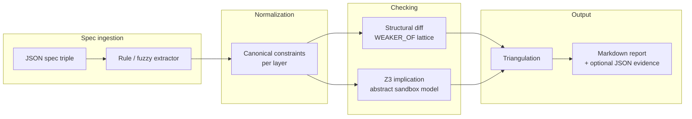
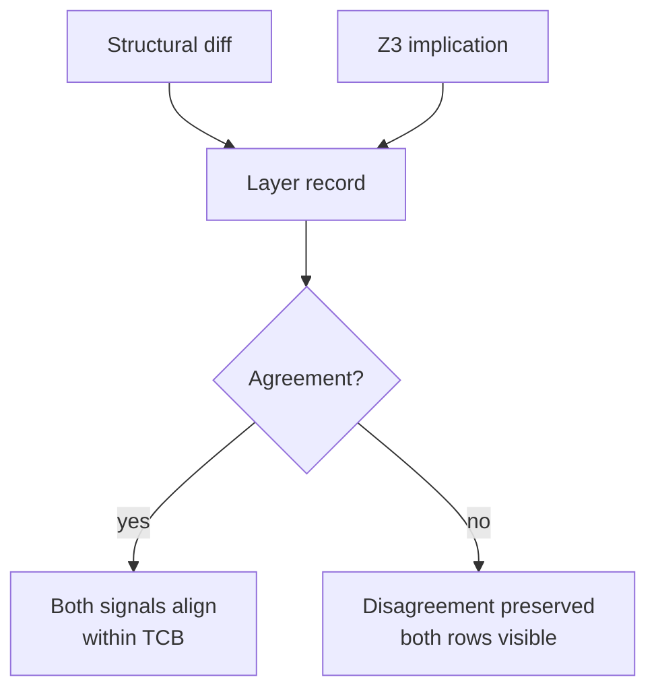
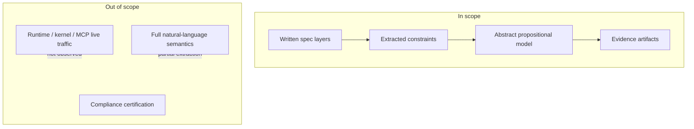

# SpecGap architecture overview

Visual-first map of the pipeline, assurance boundaries, and remaining semantic gaps. For correctness targets see [`SPECIFICATION.md`](SPECIFICATION.md).

---

## Pipeline (minimal flow)



**CLI entry:** `python -m specgap.cli <input.json> --out report.md`

**Code map:** `extractor.py` → `semantic_diff.py` + `z3_checker.py` → `triangulation.py` → `reporter.py`

---

## Stage detail

| Stage | Input | Output | Trusted component |
| --- | --- | --- | --- |
| **Spec ingestion** | `stakeholder_intent`, `formalized_policy`, `implementation_claim` (+ optional `expected_issue` annotation) | Three text layers | Author JSON honesty |
| **Normalization (extraction)** | Raw English per layer | List of `Constraint` names (`no_network`, `localhost_only`, …) | Phrase maps in [`extractor.py`](../specgap/extractor.py) |
| **Structural diff** | Constraints per layer | `Divergence` records (weakened, claim_not_implied, …) | `WEAKER_OF` lattice in [`semantic_diff.py`](../specgap/semantic_diff.py) |
| **Implication checking** | Constraints → propositional formulas | PASS / FAIL + counterexample atoms | Encoding + Z3 in [`z3_checker.py`](../specgap/z3_checker.py) |
| **Triangulation** | Structural status + Z3 status per downstream layer | Agreement yes/no table | [`triangulation.py`](../specgap/triangulation.py) |
| **Replayable evidence** | Full analysis | `*.md` report (deterministic under `--extractor rule`) | Reporter + pinned deps |

---

## Triangulation (why two arrows converge, not merge)



Disagreement is **first-class output**. Do not collapse to a single score. Example: [`06_triangulation_disagreement.json`](../examples/06_triangulation_disagreement.json).

---

## Assurance boundaries



| Boundary | Document |
| --- | --- |
| What claims mean | [`ASSURANCE_BOUNDARY.md`](ASSURANCE_BOUNDARY.md) |
| What threats are in/out of model | [`THREAT_MODEL_SUMMARY.md`](THREAT_MODEL_SUMMARY.md) |
| What PASS/FAIL does not imply | [`SPECGAP_POSITIONING.md`](SPECGAP_POSITIONING.md) |

Optional paths (`specgap-mcp/`, BoxArena pre-flight) **reuse the same boundary** — they do not add runtime verification.

---

## Trusted Computing Base (TCB)

Interpretation of any report assumes trust in:

| TCB component | Reference |
| --- | --- |
| Rule extractor phrase maps | [`TCB.md`](TCB.md) · [`extractor.py`](../specgap/extractor.py) |
| Weakening lattice | [`TCB.md`](TCB.md) · [`semantic_diff.py`](../specgap/semantic_diff.py) |
| Atom definitions + domain axioms | [`ENCODING.md`](ENCODING.md) · [`z3_checker.py`](../specgap/z3_checker.py) |
| Z3 satisfiability results | `z3-solver` package |
| Deterministic `rule` mode | Default CLI; no API key required |

**Partially trusted:** `--extractor fuzzy` (advisory only; `requires_human_review`).

**Not trusted:** English completeness, production behavior, exploit existence.

---

## Where semantic gaps remain

| Gap | Symptom | Mitigation direction |
| --- | --- | --- |
| **Vocabulary coverage** | Phrase not in extractor → silent omission | New fixtures + phrase rules; explicit extraction-failure flags |
| **Lattice incompleteness** | Structural silent, Z3 fails | Triangulation disagreement row; extend `WEAKER_OF` with tests |
| **Encoding vs English** | Counterexample valid in model, unclear in prose | [`ENCODING.md`](ENCODING.md) atom glossary; human annotation block |
| **Operational domains (MCP, multi-agent)** | Narrative exceeds TCB | [`OPERATIONAL_EXAMPLES.md`](OPERATIONAL_EXAMPLES.md) — honest mapping to sandbox atoms |
| **Runtime enforcement** | Spec consistent; build wrong | BoxArena / adversarial eval — separate obligation |

Research queue (not promises): [`RESEARCH_DIRECTIONS.md`](RESEARCH_DIRECTIONS.md).

---

## Asset diagram (repo)

Existing diagram: [`assets/specgap_architecture.svg`](assets/specgap_architecture.svg)

```
examples/*.json  ──►  specgap/cli.py  ──►  reports/*.md
                           │
                    specgap-mcp/ (optional stdio wrapper, same checks)
```

---

## Related reading

| Doc | Purpose |
| --- | --- |
| [`SPECGAP_ONE_PAGE.md`](SPECGAP_ONE_PAGE.md) | Non-architect onboarding |
| [`REPLAYABLE_EVIDENCE_EXAMPLE.md`](REPLAYABLE_EVIDENCE_EXAMPLE.md) | One end-to-end walkthrough |
| [`WHY_DISAGREEMENT_MATTERS.md`](WHY_DISAGREEMENT_MATTERS.md) | Triangulation rationale |
