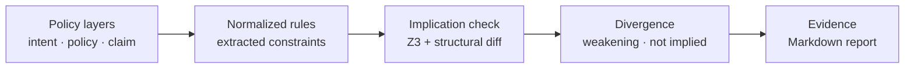
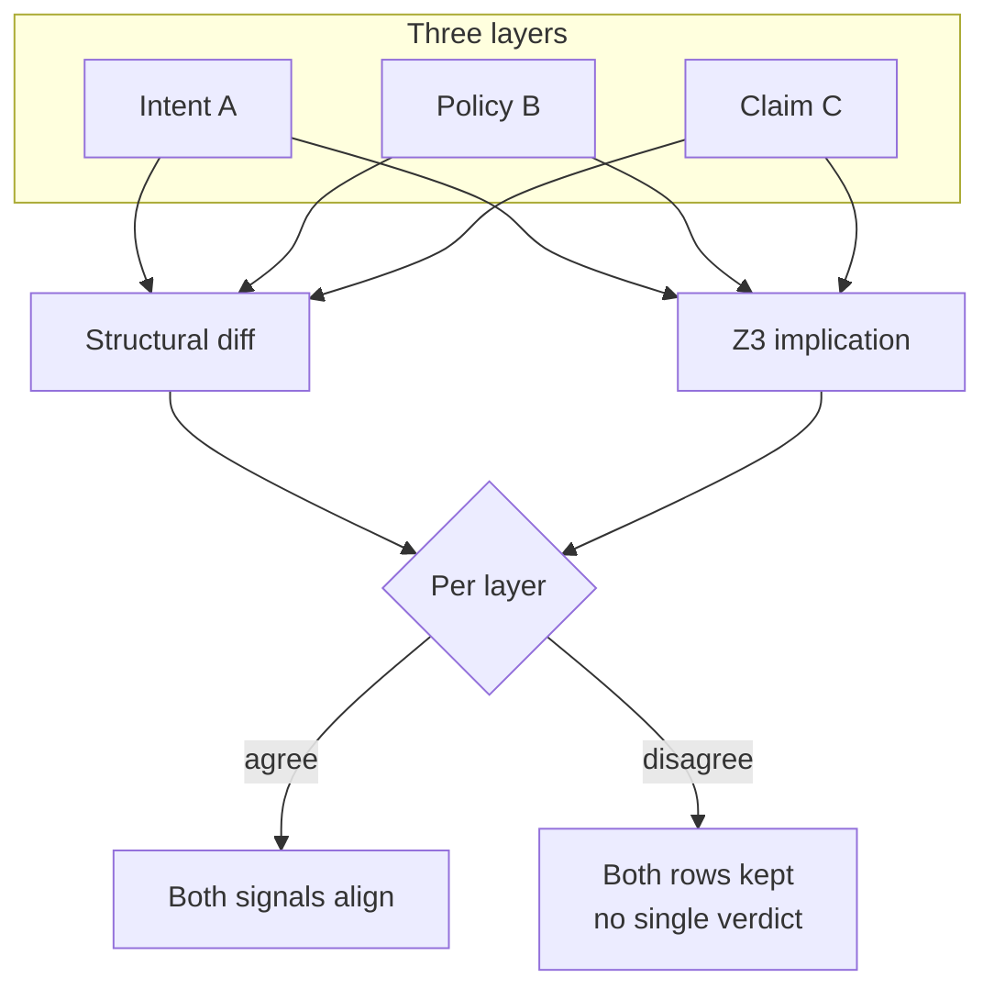
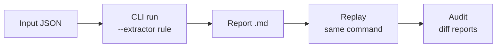

# SpecGap diagrams

Three small diagrams. Full pipeline detail: [`ARCHITECTURE_OVERVIEW.md`](ARCHITECTURE_OVERVIEW.md).

---

## A. Layered spec flow

**Read:** Written layers → canonical constraints → logical checks → findings → replayable artifact. No runtime step.

---

## B. Triangulation model

Three spec layers checked by two independent mechanisms. Outcomes are **not merged**.

**Read:** Structural diff can be silent while Z3 fails (or vice versa). **Disagreement preserved** in the report table — not averaged away.

Example: [`examples/operational/02_multi_agent_policy_divergence/`](../examples/operational/02_multi_agent_policy_divergence/).

---

## C. Replayable evidence lifecycle

**Read:** Evidence is a regenerable file. Independent reviewer runs the same command and compares output — no platform attestation required.

Walkthrough: [`REPLAYABLE_EVIDENCE_EXAMPLE.md`](REPLAYABLE_EVIDENCE_EXAMPLE.md).
